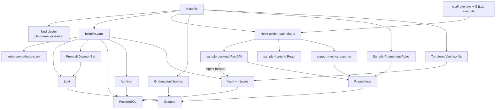
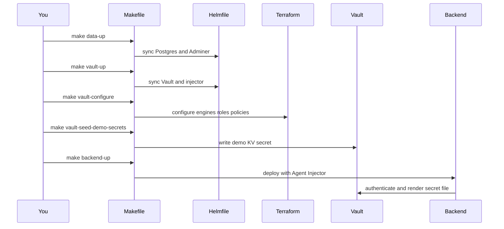

# Architecture

## Purpose

This document explains the local architecture for the Platform Engineering Introduction lab.

## Component Topology

## Runtime Flow

## Boundary Rules

- `Makefile` owns local commands.
- `infrastructure/kubernetes/helmfile.yaml` owns platform chart releases.
- `charts/` owns application and lab data golden paths.
- `apps/` owns application source.
- `terraform/` configures Vault capabilities and does not store application secret values.
- `cicd/` owns example GitLab CI and Helm overlay values for learning.
- `infrastructure/kubernetes/alerts/` owns sample PrometheusRules.
- `docs/demo-guide.md` owns the live demo walkthrough.

## Chart Compatibility

- `kube-prometheus-stack` `87.10.1`
- `loki` `6.55.0`
- `promtail` `6.16.6`
- `hashicorp/vault` `0.29.1`
- Postgres image `postgres:17-alpine`
- Adminer image `adminer:5-standalone`

## Resource Model

The lab uses memory limits and CPU requests only.

## Platform Layers

| Layer | Intent | Lab mapping |
| --- | --- | --- |
| Visibility | See what is running and how it behaves | Prometheus, Grafana, Loki, Promtail, dashboards, sample alerts |
| Controlled self-service | Safe paths to request capabilities | Vault, dynamic credentials, Adminer |
| Standardization | Reuse shared shapes instead of one-off setups | Helm golden paths, Git overlays, example CI |
