# Platform Engineering in Practice

## Session Draft

**Audience:** Experienced engineers, project managers, QA engineers, DevOps engineers, and designers  
**Duration:** ~60 minutes  
**Presentation:** ~40 minutes  
**Open discussion:** ~20 minutes  

---

# Session Goal

This session is not intended to teach the audience what Kubernetes, CI/CD, Terraform, monitoring, or DevOps are.

The audience is already familiar with those concepts.

The goal is to explore a different question:

> **How do we make good engineering practices easy to follow at scale?**

The session uses Platform Engineering as the answer, not as a replacement for DevOps, but as a practical way to reduce engineering friction, standardize repeated work, improve security, and give development teams more autonomy.

The core story of the session is:

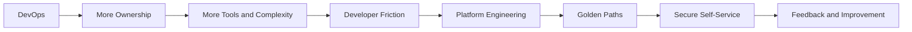

---

# Session Structure

| Time | Section |
|---|---|
| 0-5 min | My Journey into Platform Engineering |
| 5-10 min | DevOps Was Never About the Tools |
| 10-15 min | The Complexity Problem |
| 15-21 min | What Platform Engineering Actually Is |
| 21-35 min | Practical Case Study: Building a Platform from Developer Requests |
| 35-40 min | Security, Standardization, and Platform Principles |
| 40-60 min | Open Discussion |

---

# 1. My Journey into Platform Engineering

**Time:** 0-5 minutes

## Opening

I would start with a story rather than a CV.

Something like:

> I started my career as a software developer, then gradually moved closer and closer to infrastructure.
>
> I worked with CI/CD, cloud infrastructure, Kubernetes, monitoring, automation, deployment systems, security, and eventually Platform Engineering.
>
> At one point, while working as a DevOps engineer, somebody asked me to fix the office printer.
>
> It was funny, but it also represented a real problem.
>
> What exactly is DevOps responsible for?

That question stayed relevant throughout my career.

Developers were writing software.

Infrastructure teams were managing infrastructure.

DevOps was supposed to bring these worlds together.

But as systems became more complex, DevOps teams often became the people everyone depended on for everything between:

> **"My code works"**

and:

> **"My application is running safely in production."**

That journey eventually led me toward Platform Engineering.

---

# 2. DevOps Was Never About the Tools

**Time:** 5-10 minutes

## Main Point

When we talk about DevOps, we often immediately talk about tools:

- Kubernetes
- Terraform
- Jenkins
- GitHub Actions
- GitLab CI
- Prometheus
- Grafana
- Docker
- Argo CD
- Vault

But none of these tools are DevOps.

They support DevOps.

DevOps is more about improving the software delivery system.

A simple way to think about it is:

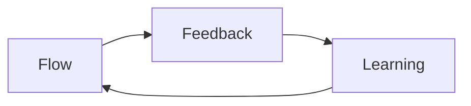

### Flow

How easily can an idea move from development to production?

### Feedback

How quickly do we know whether something is working or broken?

### Learning

How quickly can the team learn from what happened and improve the system?

The tools are there to support these goals.

---

# 3. The Complexity Problem

**Time:** 10-15 minutes

DevOps gave application teams more ownership.

Cloud platforms gave us enormous flexibility.

Then we added:

- CI/CD
- Containers
- Kubernetes
- Infrastructure as Code
- Cloud IAM
- Networking
- Secrets management
- Monitoring
- Logging
- Tracing
- Security scanning
- Deployment strategies
- GitOps
- Databases
- Message queues
- Service meshes
- Cost optimization

All of these things are useful.

But together they create a new problem.

## The Modern Developer's Accidental Job Description

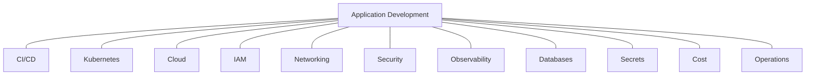

"You build it, you run it" can be a very good principle.

But there is an important question:

> **How much should an application engineer need to know before they can safely run an application?**

Ownership is valuable.

Unnecessary cognitive load is not.

This is one of the problems Platform Engineering tries to solve.

---

# 4. What Platform Engineering Actually Is

**Time:** 15-21 minutes

I think Platform Engineering becomes easier to understand when we stop thinking about tools and start thinking about problems.

A platform team asks:

> **What problems are engineers solving repeatedly?**

Then:

> **Which of those problems can we solve once and provide as a reusable capability?**

## Platform as a Product

The development teams are the users of the platform.

The platform team should therefore think like a product team.

Instead of asking:

> What infrastructure should we build?

Ask:

> What is slowing engineers down?

> What are they repeatedly asking us to do?

> Where are they making the same mistakes?

> Which best practices are difficult to follow?

> Which actions can safely become self-service?

---

## The Platform Engineering Loop

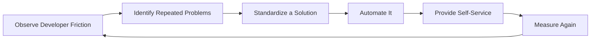

This is important.

You do not necessarily start by saying:

> "We need an Internal Developer Platform."

You can start with:

> "What are developers asking us for every day?"

---

# 5. Practical Case Study

**Time:** 21-35 minutes

# We Did Not Start with a Platform

The practical example I want to share is from a platform we built for engineers.

We did not begin with:

> "Let's build a Platform Engineering product."

We began by identifying what engineers needed.

A lot of the roadmap came from support requests directed at the DevOps and infrastructure team.

One of the best ways to describe the process is:

> **Our support queue became part of our platform roadmap.**

---

# Step 1: Establish a Secure Operational Foundation

Before giving engineers more visibility and control, we needed a secure way to access internal systems.

We used **WireGuard VPN** and kept operational interfaces private.

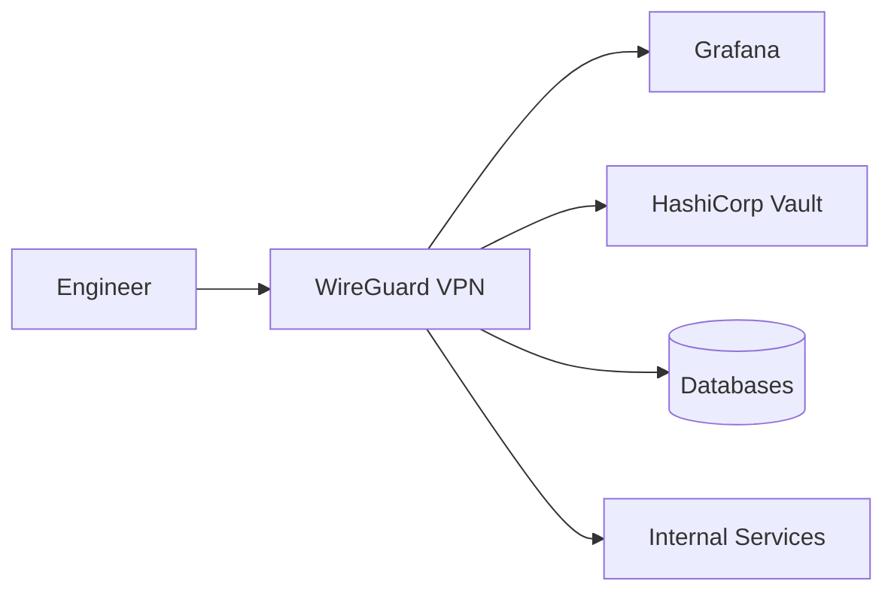

The important principle was:

> **Internal operational systems should not automatically become public systems simply because developers need access to them.**

---

# Step 2: Observability First

One of the first capabilities we implemented was observability.

We introduced:

- Prometheus for metrics collection
- Grafana for visualization
- Alertmanager integrations for communication tools such as Slack, Teams, or Discord

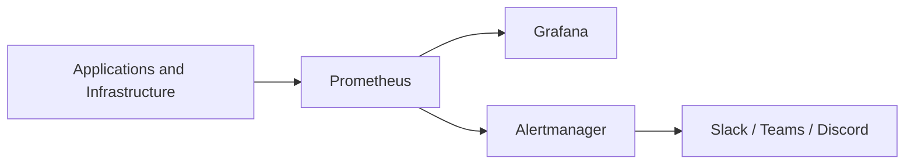

This gave the infrastructure team much better visibility.

But then we asked another question:

> Why should only the infrastructure team have this visibility?

---

# Step 3: Measure the DevOps Support Queue

We started tracking the types of requests developers were sending to the DevOps and infrastructure team.

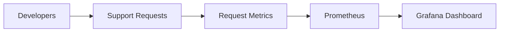

This changed the conversation.

Instead of:

> "Developers keep asking us for things."

we could identify exactly what they were asking for.

Repeated requests became signals.

---

# Request Type 1: "Can You Check My Resources?"

A large number of requests were related to resource utilization.

Developers wanted to know:

- How much CPU is my service using?
- Is memory close to the limit?
- Is the service receiving traffic?
- Is disk I/O becoming a bottleneck?
- Is the application actually using the resources we allocated to it?

Previously:

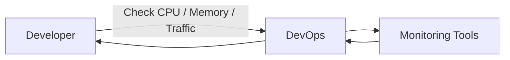

This was unnecessary human routing.

So we created Grafana dashboards for development teams.

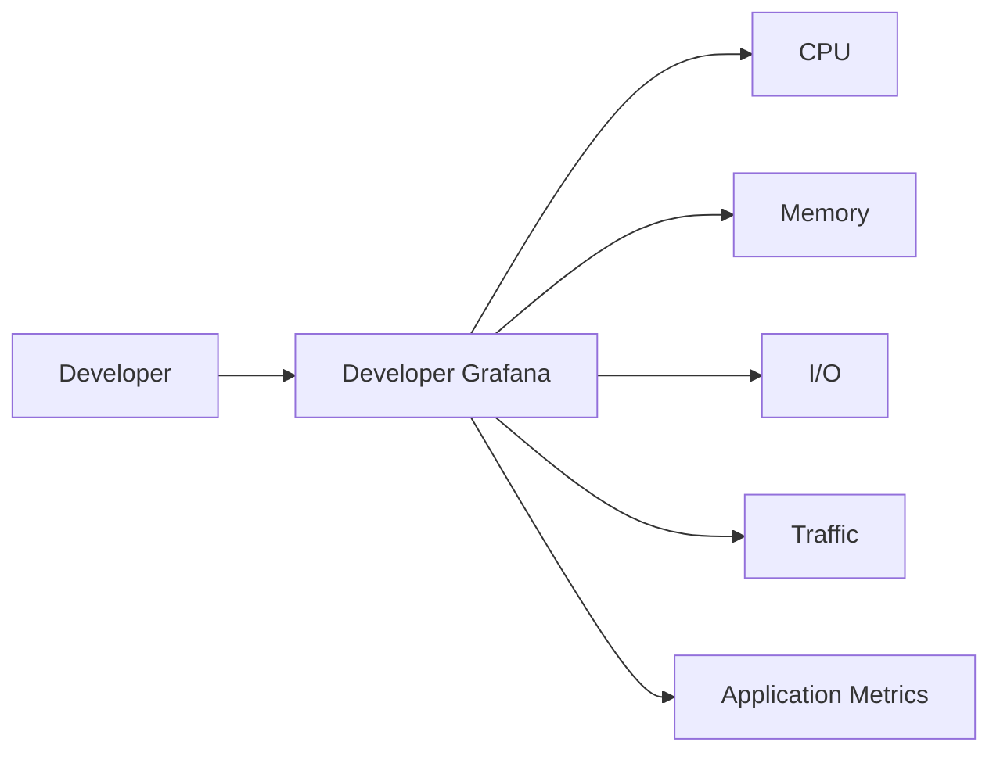

Now developers could investigate their own services.

## Lesson

> **If developers repeatedly ask for information they can safely access themselves, give them visibility instead of becoming an information proxy.**

---

# Request Type 2: "Can You Check My Logs?"

The next common request was logging.

Developers needed the DevOps team to look at application logs.

So we added **Loki** to the observability stack and provided developers with controlled access to their logs.

Before:

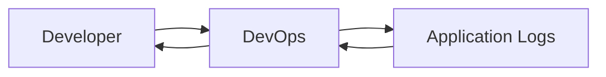

After:

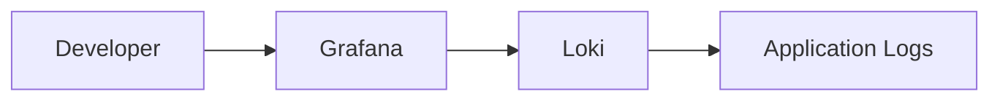

## Lesson

> **A good platform removes unnecessary humans from repeatable workflows.**

DevOps should not become a search engine for logs.

---

# Request Type 3: "Can You Change My Deployment?"

Then the requests became more operational.

Examples included:

- Increase CPU
- Increase memory
- Change replicas
- Modify Kubernetes configuration
- Change NGINX configuration
- Modify CI pipelines

We created a dedicated **CI/CD repository**.

It contained things such as:

```text
cicd/
├── pipelines/
├── kubernetes/
├── nginx/
└── deployment-config/
```

Team leads received access to modify the repository.

Developers did not receive unrestricted infrastructure access.

Instead, we exposed a controlled interface through Git.

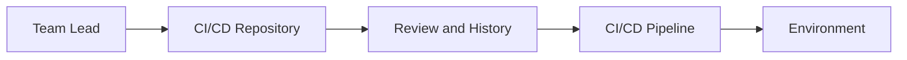

## Lesson

> **Self-service does not mean unrestricted access.**

The platform gives teams autonomy through controlled interfaces.

Changes become:

- Version controlled
- Reviewable
- Auditable
- Reproducible

---

# Request Type 4: "Can You Change This Secret or Environment Variable?"

We also received many requests for secrets and sensitive environment configuration.

Instead of having DevOps manually change these values, we introduced **HashiCorp Vault**.

Team leads received controlled access to manage application secrets and sensitive environment values.

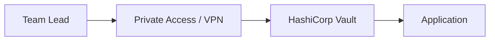

## Lesson

> **Move responsibility to the team that owns the application, but put security boundaries around that responsibility.**

---

# Request Type 5: "Can I Access the Database?"

Database access was another recurring request.

The easiest solution would have been to distribute permanent usernames and passwords.

We chose a different model.

HashiCorp Vault generated temporary database credentials.

The approximate credential lifetimes were:

| Environment | Credential Lifetime |
|---|---|
| Development | 1 week |
| Staging | 1 day |
| Production | 1 hour |

Database access was available only through the private network.

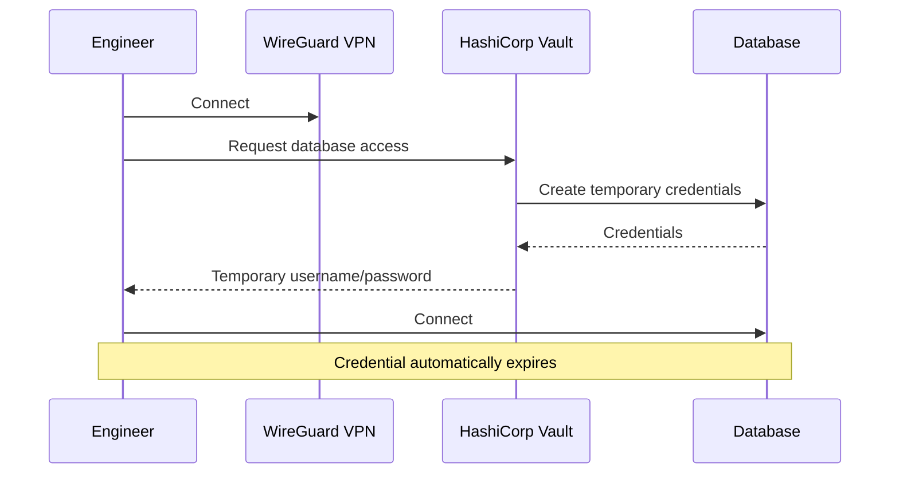

## Lesson

> **Security and developer experience do not have to fight each other.**

The experience became easier for developers while the security model became stronger.

---

# 6. Standardization: Helm as a Platform Capability

Self-service solved one class of problem.

But another problem remained.

Different teams could still solve the same deployment problem in completely different ways.

So we standardized common application deployment patterns with Helm.

We maintained a main Helm chart for each major type of service.

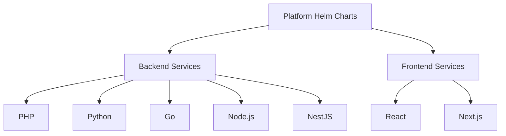

Each chart represented an opinionated deployment pattern.

Depending on the workload, these patterns could include:

- Kubernetes Deployment
- Service
- Ingress
- Health probes
- Resource configuration
- Autoscaling
- Labels and annotations
- Environment configuration
- Monitoring integration
- Security defaults

The important thing was not:

> "We used Helm."

The important thing was:

> **Teams did not have to redesign how a Python backend or React frontend should be deployed every time they created a service.**

---

# Golden Paths by Workload Type

A golden path does not mean every application must be identical.

Instead:

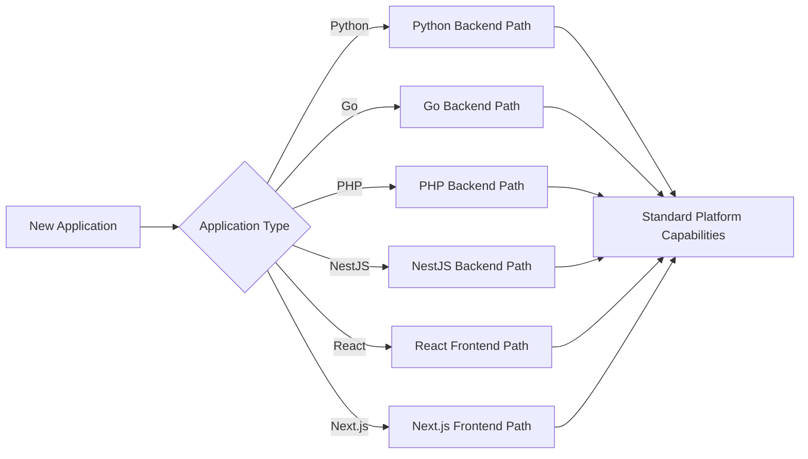

## Lesson

> **Standardization does not mean pretending every workload is identical.**

We standardized where standardization created value.

---

# 7. Terraform as a Platform Capability

Helm standardized how applications were deployed.

Terraform standardized the infrastructure those applications depended on.

We created reusable Terraform modules for things such as:

- Databases
- Elasticsearch
- Service accounts
- IAM
- Networking
- Infrastructure required by deployments
- Other commonly requested cloud resources

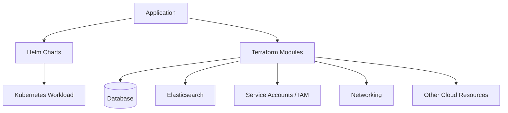

Instead of treating every database request as a new infrastructure project:

> Database provisioning became a reusable platform capability.

The same applied to other common infrastructure resources.

---

# 8. Terraform and Vault

We also used Terraform to manage the **configuration and infrastructure around Vault**.

Terraform could manage things such as:

- Vault secret engines
- Secret paths and structures
- Database connections
- Policies
- Roles
- Dynamic credential configuration
- Temporary AWS access roles when required

But there was an important boundary.

> **Terraform did not manage the actual secret values.**

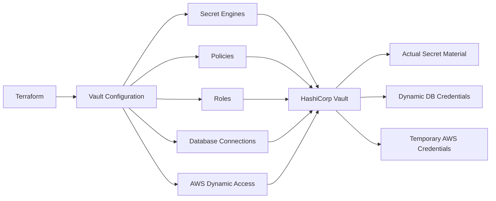

The separation can be described simply as:

```text
Terraform = defines and configures the system

Vault = protects and delivers the secret material
```

This allowed us to keep infrastructure configuration reproducible without putting sensitive secret content into Terraform state.

---

# 9. Three Layers of the Platform

Looking back, the platform evolved through three important layers.

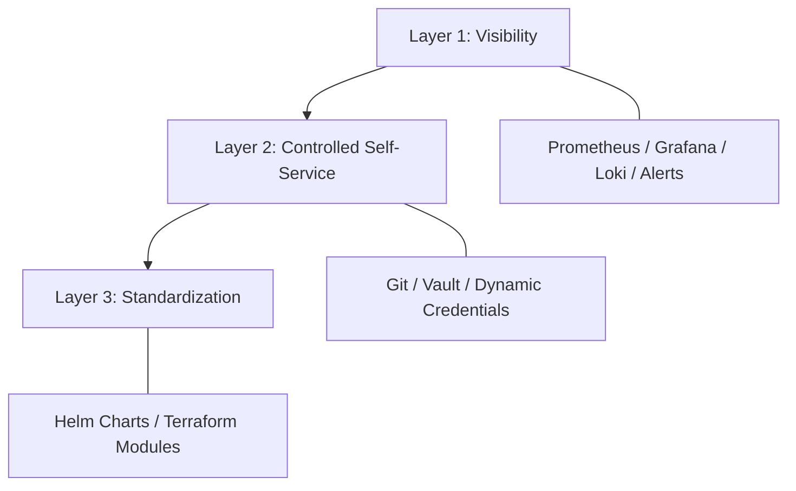

## Layer 1: Visibility

Give engineers the information they need.

Examples:

- Prometheus
- Grafana
- Loki
- Alerts

---

## Layer 2: Controlled Self-Service

Let teams perform common actions without relying on DevOps for every request.

Examples:

- CI/CD repository
- Deployment configuration
- Vault
- Dynamic database credentials
- Team lead permissions

---

## Layer 3: Standardization

Stop every team from solving the same engineering problems differently.

Examples:

- Helm charts
- Terraform modules
- Vault configuration through Terraform

---

# 10. Requests Became Platform Capabilities

| Repeated Request | Platform Capability |
|---|---|
| "How much CPU or memory am I using?" | Developer Grafana dashboards |
| "Can you check my logs?" | Loki access |
| "How do I know when something breaks?" | Prometheus + Alertmanager |
| "Can you change my deployment resources?" | Git-managed deployment configuration |
| "Can you modify my CI pipeline?" | Shared CI/CD repository |
| "Can you change this secret?" | Vault |
| "Can I access the database?" | Vault dynamic credentials |
| "How do I deploy a Python backend?" | Standard Python Helm chart |
| "How do I deploy a frontend?" | Standard frontend Helm chart |
| "Can you create a database?" | Terraform database module |
| "Can you create Elasticsearch?" | Terraform module |
| "Can you create a service account?" | Terraform IAM modules |
| "How do we configure Vault?" | Terraform-managed Vault configuration |
| "Can I temporarily access AWS?" | Vault temporary credentials |

The important pattern is:

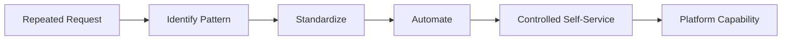

---

# 11. The Full Platform

One important point is that our platform was not one giant application.

There was no requirement for everything to exist behind one portal.

The platform was the set of supported capabilities and interfaces that engineers used.

```mermaid
flowchart TB
    USERS[Engineering Teams]

    USERS --> OBSERVE[Observe]
    USERS --> CONFIGURE[Configure]
    USERS --> DEPLOY[Deploy]
    USERS --> ACCESS[Access]

    OBSERVE --> GRAF[Grafana]
    OBSERVE --> LOKI[Loki]

    CONFIGURE --> GIT[CI/CD Repository]
    CONFIGURE --> VAULT[Vault]

    DEPLOY --> CI[CI/CD]
    CI --> HELM[Helm Charts]

    ACCESS --> VPN[WireGuard VPN]
    ACCESS --> VAULT

    HELM --> K8S[Kubernetes]

    GIT --> TF[Terraform Modules]
    TF --> DB[(Databases)]
    TF --> ES[Elasticsearch]
    TF --> IAM[IAM / Service Accounts]
    TF --> CLOUD[Cloud Resources]

    VAULT --> DYNAMIC[Dynamic Credentials]

    K8S --> PROM[Prometheus]
    DB --> PROM
    CLOUD --> PROM

    PROM --> GRAF
```

## Main Point

> **A platform is not necessarily a portal.**

A platform is a set of supported capabilities and interfaces that allow engineers to do the right thing with less friction.

---

# 12. Golden Paths and Guardrails

There is an important distinction between a **golden path** and a **mandatory guardrail**.

A golden path should be attractive because it makes development easier.

For example:

> "Use our Python backend chart and most of the deployment work is already solved."

But some requirements are not optional.

Examples:

- Production databases must not be publicly accessible
- Credentials should not live permanently in repositories
- Access should follow least privilege
- Sensitive systems should have appropriate network boundaries
- Changes should be auditable

```mermaid
flowchart LR
    DEV[Developer Choice] --> GOLDEN[Golden Path]
    GOLDEN --> EASY[Easier Delivery]

    SECURITY[Security Requirements] --> GUARD[Mandatory Guardrails]
    GUARD --> SAFE[Safe Delivery]

    EASY --> PLATFORM[Platform Experience]
    SAFE --> PLATFORM
```

## Main Point

> **Self-service does not mean removing control.**

Good platforms increase autonomy while keeping sensible boundaries.

---

# 13. Platform Engineering Is Not About Removing Responsibility

One of the ideas I want the audience to leave with is:

> **Platform Engineering is not about taking responsibility away from developers. It is about removing unnecessary responsibility from developers.**

Application teams should still own their applications.

They should understand:

- How their services behave
- Their resource requirements
- Their dependencies
- Their failures
- Their operational responsibilities

But they should not have to solve every infrastructure problem from scratch.

---

# 14. Platform Engineering as Product Thinking

The platform should continuously evolve based on what engineering teams need.

```mermaid
flowchart LR
    USERS[Engineering Teams] --> FEEDBACK[Requests and Friction]
    FEEDBACK --> PLATFORM[Platform Team]
    PLATFORM --> CAPABILITY[New or Improved Capability]
    CAPABILITY --> USERS
```

This means the platform roadmap should not be based only on:

- Which technology looks interesting
- Which tool is currently popular
- What the platform team personally wants to build

Instead, it should be connected to actual engineering problems.

A useful question is:

> **What is the engineering organization repeatedly spending time on that should already be solved?**

---

# 15. What Good Platform Engineering Should Improve

A useful platform should improve things such as:

### Developer Experience

- Less waiting
- Less unnecessary context switching
- Faster debugging
- Easier deployments
- Easier infrastructure access

### Security

- Short-lived credentials
- Least privilege
- Private access
- Auditable changes
- Standard security defaults

### Reliability

- Standardized deployments
- Monitoring by default
- Logging by default
- Repeatable infrastructure

### Organizational Efficiency

- Fewer support requests
- Less repeated DevOps work
- More team autonomy
- More predictable delivery

---

# 16. Key Takeaways

Before moving to discussion, summarize the session with a few principles.

## 1. Start with developer problems, not platform tools

> Do not start with "we need Backstage."

Start with:

> "What is slowing teams down?"

---

## 2. Repeated requests are signals

Every repeated request should make you ask:

> Can this become a platform capability?

---

## 3. Self-service should have boundaries

Self-service is not unrestricted production access.

The goal is controlled autonomy.

---

## 4. Standardize repeated engineering decisions

Use reusable patterns such as:

- Helm charts
- Terraform modules
- CI/CD templates
- Secure access patterns

---

## 5. Security should be part of the path

Do not ask every developer to independently remember every security rule.

Encode important security decisions into the platform.

---

## 6. A platform is not necessarily a portal

The platform can be:

- Git
- CI/CD
- Grafana
- Vault
- Helm
- Terraform
- APIs
- CLIs
- Portals

The important thing is the experience and capability provided.

---

# 17. Open Discussion

**Time:** 40-60 minutes

Instead of beginning with only:

> "Any questions?"

start with a few prompts.

## Discussion Question 1

> **What is the most annoying repeated step between writing code and running it in production in your organization?**

---

## Discussion Question 2

> **What do developers currently need to ask another team to do for them?**

---

## Discussion Question 3

> **Which engineering or security rule currently exists only as documentation, but could become automation?**

---

# A Framework for the Discussion

When someone presents a problem, walk through this model together:

```mermaid
flowchart LR
    P[Problem] --> R{Does It Repeat?}

    R -->|No| MANUAL[Handle Normally]
    R -->|Yes| STANDARD[Can We Standardize It?]

    STANDARD --> AUTO[Can We Automate It?]
    AUTO --> SELF[Can It Become Self-Service?]
    SELF --> SECURITY[What Guardrails Are Needed?]
    SECURITY --> CAPABILITY[Platform Capability]
```

Example:

> "Getting a test environment takes two days."

Ask:

1. Does the problem repeat?
2. Can we define a standard test environment?
3. Can provisioning be automated?
4. Can teams create it themselves?
5. What permissions, limits, and security controls should exist?
6. How do we know whether the solution actually reduced friction?

This turns the discussion into a small Platform Engineering exercise rather than only a Q&A.

---

# Closing Thought

Platform Engineering is sometimes presented as a collection of modern infrastructure tools.

I see it differently.

It is a way of looking at the engineering organization and asking:

> **What problems are we making every developer solve individually that we could solve once as an organization?**

Then we build reusable capabilities around those problems.

The platform is successful when developers spend less time fighting infrastructure, security becomes easier to follow, teams gain more autonomy, and the organization can deliver software more effectively.

---

# Optional Final Slide

> **Observe the friction.**
>
> **Find the repetition.**
>
> **Standardize the solution.**
>
> **Automate it.**
>
> **Make it safely self-service.**
>
> **Measure again.**

```mermaid
flowchart LR
    OBS[Observe] --> FIND[Find Repetition]
    FIND --> STD[Standardize]
    STD --> AUTO[Automate]
    AUTO --> SELF[Self-Service]
    SELF --> MEASURE[Measure]
    MEASURE --> OBS
```
